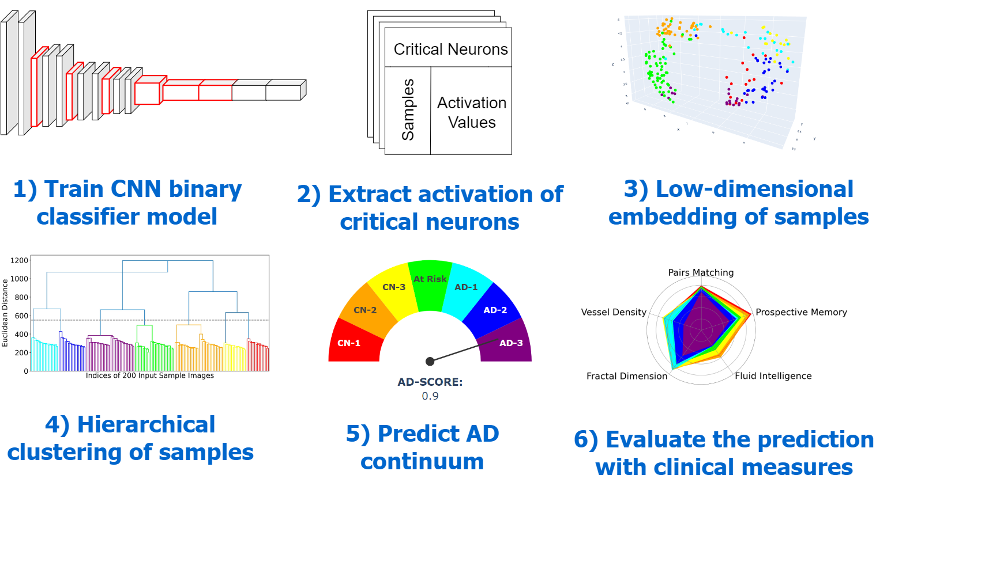

# LAVA
LAVA: Granular Neuron-Level Explainable AI for Alzheimer’s Disease Assessment from Fundus Images

## Overview
LAVA is an XAI framework that aims to exploite neuron-level explanation as auxiliary information during learnign process to make a high-resolution AD continuum prediction. This work is supported by the National Science Foundation under Grant No. (NSF 2123809). This repository is provided to reproduce experimental results for this research work. For more details refer to our paper: {link to the paper}

## Citation
If you use LAVA in your research, please cite our preliminary work published in arXiv.
{TBD}

## Installation
The following command uses the file `environmental.yml` in this project's root folder to create a conda virtual environement named `LAVA_env` with all dependencies installed.
```
conda env create -f environment.yml
```
Activate the environment.
```
conda activate LAVA_env
```

For more information on conda please refer to [conda docs](https://docs.conda.io/projects/conda/en/latest/user-guide/getting-started.html).

**Note:** The `requirements.txt` file lists a lot of dependencies. But most of them are requirements of just a handful of packages necessary for running this project. You might create your conda environment manualy and install the following requiements; it should produce a similar environment but may result in packages with different version numbers.

Required libraries:<br>
torch 1.9.0<br>
torchvision 0.10.0<br>
pandas 1.2.4<br>
numpy 1.20.2<br>
sklearn 0.23.2<br>
matplotlib 3.6.1<br>
plotly 5.3.1<br>
scipy 1.9.0<br>
seaborn 0.11.2<br>


## Specify file paths
You will need to modify the following paths according to your own machine.
- `data_dir`: where the segemented input images are stored
- `model_dir`: where the trained models will be saved
- `out_dir`: where the results of the experiment will be saved.


## Download and preprocess data
The raw data in this research is downloaded from [UK Biobank](https://www.ukbiobank.ac.uk/) Resource under application number 48388.

## Train the model 
```
python -m train
```
Any models generated during training are saved in `models` directory.
## Test the model
```
python -m test
```
## Prediction
The follwoing script is the main brain of the LAVA running XAI Knowledge discovery to predict AD continuum.
The models trained through 5-fold cross-validation paradigm are loaded up and evaluated on the test sets. During the evaluation process, top-k critical neurons are identified and ensembled through the network. 
```
python -m prediction --r <number of latent subclasses> --d <number of adjacent neighbors> --k <number of top-k neurons to select at each layer> --s <number of pruning neurons at each step of RFE> --data_dir  <the path to the data directory> --model_dir <the path to the models directory> --out_dir <the path to the results directory>
```
Alternatively, you can run the script with all the default parameters.
```
python -m prediction
```

Any outputs generated during training are saved in `results` directory.

For default arguments the validation accuracies of the 5-fold cross validation should be in the ballpark of the following

|Test-Fold 1|Test-Fold 2|Test-Fold 3|Test-Fold 4|Test-Fold 5|
|---|---|---|---|---|
|0.80|0.68|0.80|0.75|0.72|

**A note on reproducibility:** Reproducing the above numbers is possible only if all of the following are true:
- random seeds in the scripts are set to .....
- `train_val_split`....
- default arguments are used during training
